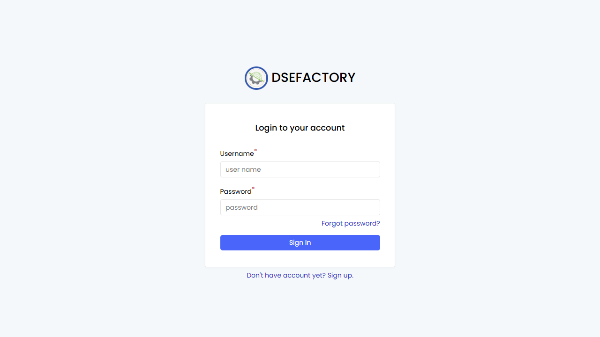

# Role-Based User Manuals

> English | [zh-CN](../../zh-CN/03-by-role/README.md)

New to the demo? Start with the [operating guide](../00-start-here.md), then return here to choose the role that matches your review question.

Use this section when you want a practical manual by job role instead of by
module. Each role page lists the normal daily workflow, the screens to open,
what to check before handing work to the next person, and where to escalate
common problems.

## Operating Flow

1. Check engineering readiness when the part, BOM, recipe, machine, or NC program is in question.
2. Use the [planner walkthrough](../01-workflows/planner-cold-start.md) to review the work order, schedule, release, and queue readiness.
3. Use the [operator walkthrough](../01-workflows/operator-run-next-job.md) to understand how work is found, started, reported, inspected, and completed.
4. Use the [supervisor triage](../01-workflows/supervisor-triage.md) to check blockers and handover.
5. Use the quality flow when inspection, NCR, SMARTQC, or calibration affects the job.
6. Use the [admin setup checklist](../01-workflows/admin-setup-checklist.md) when access, worker identity, roles, translations, or master-data prerequisites affect what a user can see.
7. Use the [operating glossary](../00-glossary.md) when a status or queue term is unclear.

| Role | Start here | Main outcome |
|---|---|---|
| Shop-floor operator | [Operator](operator.md) | Run assigned work, record output, complete required checks |
| Production planner | [Planner](planner.md) | Turn demand into scheduled and released work orders |
| Production engineer | [Production engineer](production-engineer.md) | Maintain routings, recipes, machine capability, and NC program readiness |
| Production supervisor / lead | [Production supervisor](production-supervisor.md) | Monitor the shift, resolve work-order blockers, and coordinate handover |
| Quality engineer | [Quality engineer](quality-engineer.md) | Define inspection plans, review records, manage NCR and calibration |
| System administrator | [Users and Roles](../40-administration/users-and-roles.md) | Manage user access through the visible administration pages |

## Screen Chapters

| Area | Pages |
|---|---|
| Production | [Production Orders](../10-production/production-orders.md), [Planning](../10-production/planning.md), [Queue System](../10-production/queue-system.md), [Manual Tasks](../10-production/manual-tasks.md), [Dashboards](../10-production/dashboards.md) |
| Engineering | [Parts](../20-engineering/parts.md), [BOM](../20-engineering/bom.md), [Recipes](../20-engineering/recipes.md), [Machines](../20-engineering/machines.md), [NC Programs](../20-engineering/nc-programs.md) |
| Quality | [Inspection Planning](../30-quality/inspection-planning.md), [Inspection Records](../30-quality/inspection-records.md), [NCR](../30-quality/ncr-non-conformance.md), [Equipment Calibration](../30-quality/equipment-calibration.md) |
| SMARTQC | [Check Sheets](../35-smartqc/check-sheets.md), [Inspection](../35-smartqc/inspection-data-entry.md), [Methods and Groups](../35-smartqc/methods-and-groups.md) |
| Administration | [Users and Roles](../40-administration/users-and-roles.md) |
| Operating workflows | [Planner Walkthrough](../01-workflows/planner-cold-start.md), [Operator Walkthrough](../01-workflows/operator-run-next-job.md), [Supervisor Triage](../01-workflows/supervisor-triage.md), [Admin Setup Checklist](../01-workflows/admin-setup-checklist.md), [Operating Glossary](../00-glossary.md) |

## Screenshot Status

A DS_ERP login-page capture is referenced above. Role pages include
additional screenshots for [Queue System](../10-production/queue-system.md),
[Planning](../10-production/planning.md), [Recipes](../20-engineering/recipes.md),
[Machines](../20-engineering/machines.md), [NC Programs](../20-engineering/nc-programs.md),
Quality, SMARTQC, and [Administration](../40-administration/users-and-roles.md) pages.

