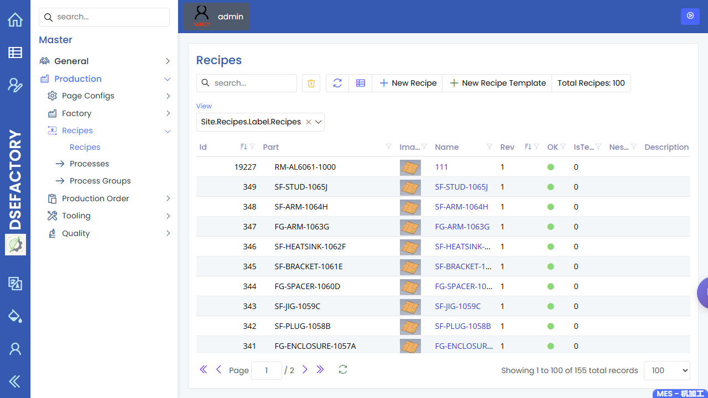
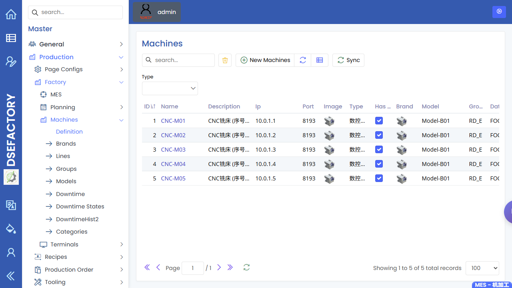

# Production Engineer Manual

> English | [zh-CN](../../zh-CN/03-by-role/production-engineer.md)

You are the **production engineer**. You keep the manufacturing definition
usable: parts, BOM, recipes, process steps, machine capability, NC programs,
cycle-time assumptions, and the handoff rules between planning, production,
and quality.

## Your Operating Flow

```
New part or revision
      |
      v
Check part + BOM --> Build recipe/processes --> Confirm machines
      |                       |                          |
      v                       v                          v
Prepare NC program      Validate cycle time        Hand off to planner
      |                                                   |
      v                                                   v
Support first run  -->  Review issues  -->  update recipe/setup data
```

## Screens You Use Most

| Screen | What you do here |
|---|---|
| [Parts](../20-engineering/parts.md) | Confirm the production part, revision, drawing, material, and quality links are ready. |
| [BOM Master and BOM Structure](../20-engineering/bom.md) | Check parent/child material structure before planning generates work. |
| [Recipes](../20-engineering/recipes.md) | Maintain the routing shell for a part or product family. |
| [Recipe Processes](../20-engineering/recipes.md) | Define the ordered manufacturing process steps, expected cycle time, and process relationships. |
| [Machines, machine groups, and lines](../20-engineering/machines.md) | Confirm the target machines and groups exist and match the process capability. |
| [NC Programs](../20-engineering/nc-programs.md) | Maintain CNC program references and make sure the correct revision is ready for production. |
| [Production Orders](../10-production/production-orders.md) | Inspect generated work orders and diagnose routing, quantity, or status issues. |
| [Inspection Planning](../30-quality/inspection-planning.md) | Coordinate with QA so the correct inspection stage is attached to the process. |

## First Article / New Revision Checklist

1. Confirm the [Part](../20-engineering/parts.md) has the correct revision,
   description, drawing reference, and active status.
2. Check [BOM Master](../20-engineering/bom.md) for missing materials or
   unexpected child parts.
3. Create or update the [Recipe](../20-engineering/recipes.md).
4. Add each [Recipe Process](../20-engineering/recipes.md) in
   the real shop-floor order.
5. Assign capable [Machines](../20-engineering/machines.md) or machine groups.
6. Confirm the [NC Programs](../20-engineering/nc-programs.md) record and
   revision are available before the planner releases work.
7. Ask QA to confirm [Inspection Planning](../30-quality/inspection-planning.md)
   and SMARTQC setup.
8. Support the first production run and update cycle-time or setup assumptions
   if actual performance differs from the recipe.

## During Production

| Situation | What to check |
|---|---|
| Planner cannot generate expected orders | [Recipe](../20-engineering/recipes.md) process list, [BOM](../20-engineering/bom.md) link, and [part](../20-engineering/parts.md) revision setup |
| Work order reaches the wrong machine group | [Recipe](../20-engineering/recipes.md) process machine assignment and [machine](../20-engineering/machines.md) group mapping |
| NC program mismatch on the floor | [NC Programs](../20-engineering/nc-programs.md) record, part revision, and machine compatibility |
| Cycle time is unrealistic | [Recipe](../20-engineering/recipes.md) process cycle-time fields and recent production records |
| Quality check appears at the wrong stage | [Inspection Planning](../30-quality/inspection-planning.md) and check-sheet link to part/process |

## Handoff Rules

- Hand off to the **planner** only after the part, BOM, recipe, machine
  capability, and NC program are ready.
- Hand off to the [quality engineer](quality-engineer.md) when inspection stages, CMM programs,
  or SMARTQC check sheets need definition or revision.
- Hand off to the **administrator** if a required page is hidden by permissions
  or master-data setup is blocked by access.

## Screenshots

Recommended screenshots for this role:

| Capture | Suggested page |
|---|---|
| Part setup for production readiness | [Parts](../20-engineering/parts.md) |
| Recipe process route | [Recipe Processes](../20-engineering/recipes.md) |
| Machine capability list | [Machines](../20-engineering/machines.md) |
| NC program list | [NC Programs](../20-engineering/nc-programs.md) |
| BOM structure review | [BOM](../20-engineering/bom.md) |



The recipes screenshot shows the authenticated recipe maintenance page used to
review production routings and process definitions.



The machines screenshot shows the master-data list used to confirm machine
capability and grouping.


The NC programs screenshot shows the program catalog used to confirm CNC program
readiness before release to production.


The parts screenshot shows the authenticated list used to confirm production
part readiness before route and BOM review.


The BOM screenshot shows the authenticated structure page used to review
parent and child material relationships.

## Read Next

- [Planner manual](planner.md)
- [Quality engineer manual](quality-engineer.md)
