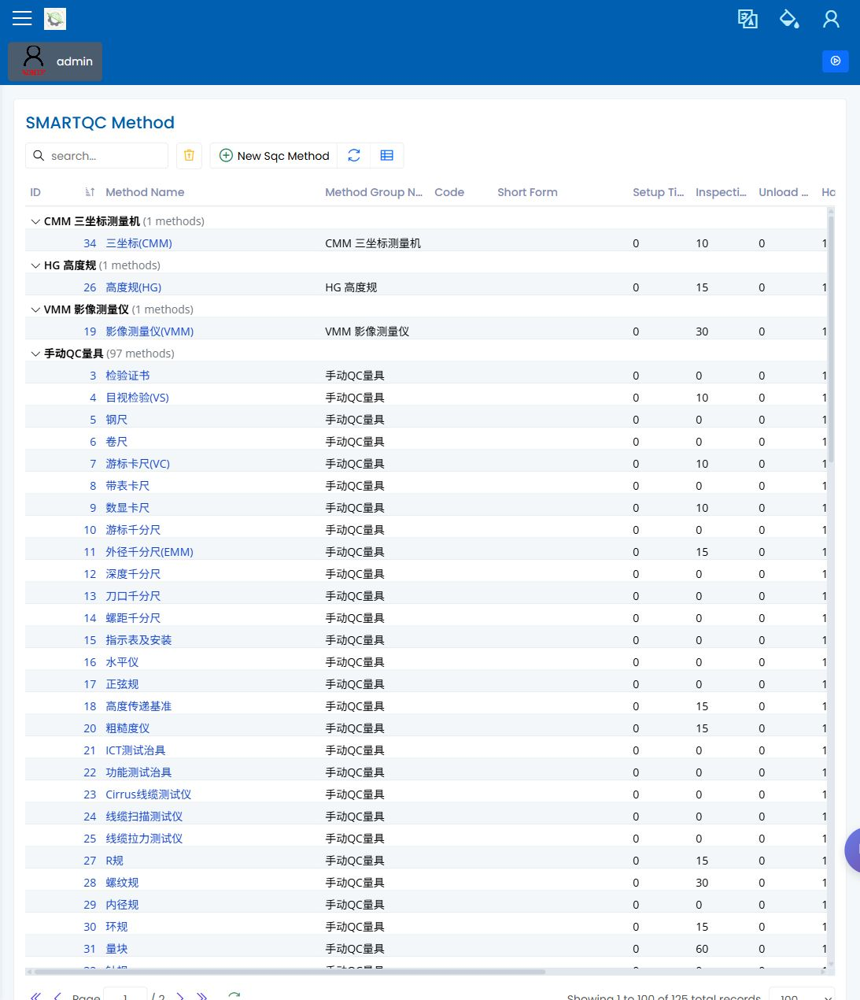
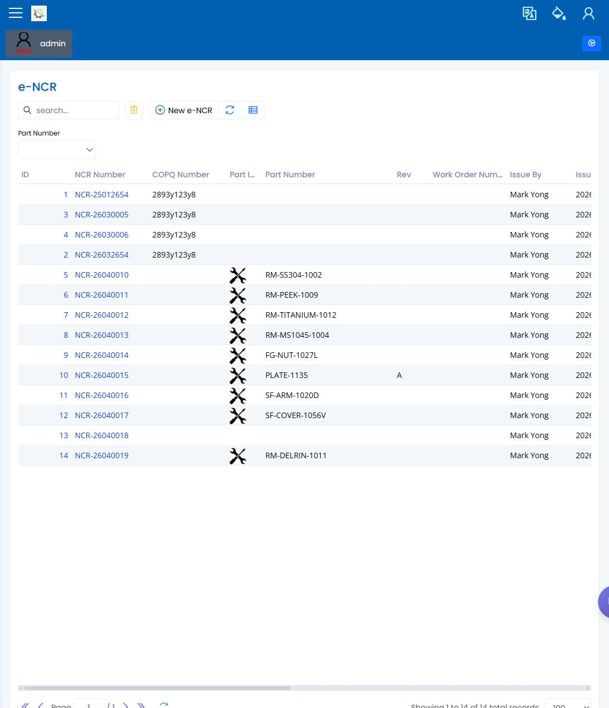
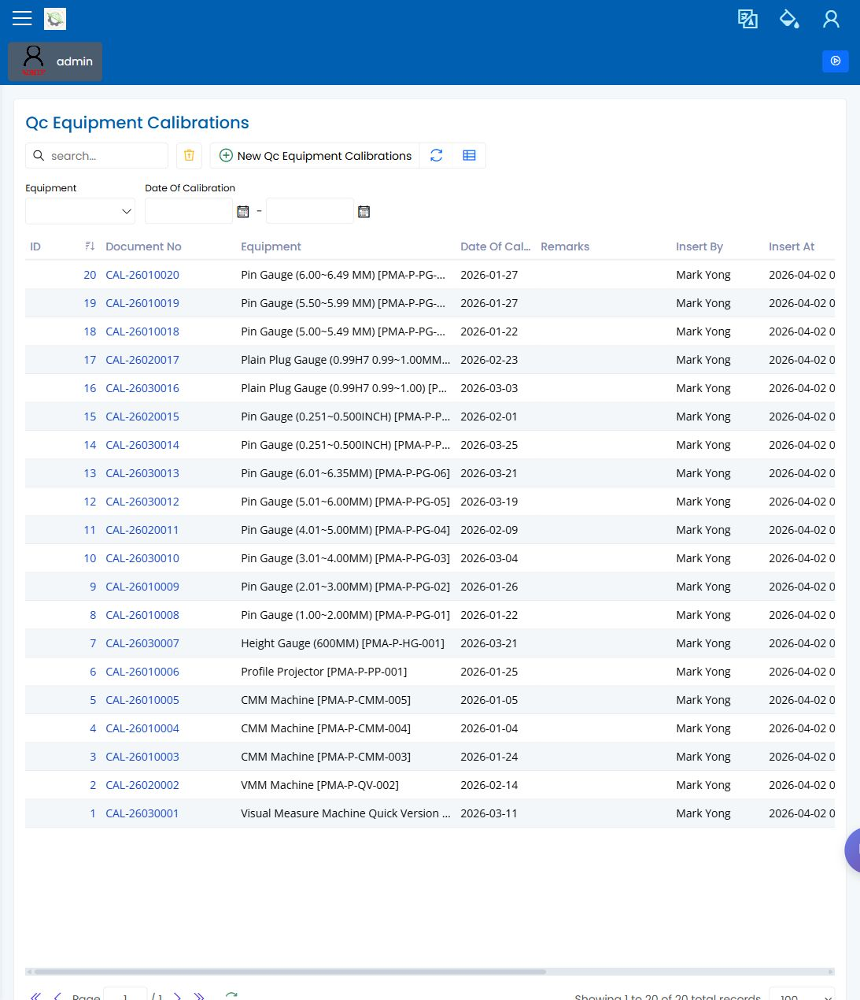

# Quality Engineer Manual

> [English](quality-engineer.md) | [中文](../../zh-CN/03-by-role/quality-engineer.md)

Use this role guide when reviewing the quality screens during the internal workflow. Quality/QC and Inspection Planning are still pending owner confirmation, so this manual keeps them visible and includes captured screens for review instead of hiding the area.

## Daily Flow

1. Confirm which production stages require inspection.
2. Check that the SMARTQC check sheet is ready before the job reaches the shop floor.
3. Review inspection entries and follow up on failed or incomplete results.
4. Open an NCR when a defect needs formal review.
5. Check calibration readiness before a measuring device is used for inspection.

## Screens You Use Most

| Screen | What you do here | Visual status |
|---|---|---|
| [Inspection Planning](../30-quality/inspection-planning.md) | Attach inspection requirements to production stages. | Captured |
| [SMARTQC Check Sheets](../35-smartqc/check-sheets.md) | Review check-sheet versions and inspection items. | Captured |
| [SMARTQC Inspection Data Entry](../35-smartqc/inspection-data-entry.md) | Review or enter inspection results. | Captured |
| [SMARTQC Methods and Groups](../35-smartqc/methods-and-groups.md) | Maintain visible method names and groups used by check sheets. | Captured |
| [NCR](../30-quality/ncr-non-conformance.md) | Record and review non-conformance details. | Captured |
| [Equipment Calibration](../30-quality/equipment-calibration.md) | Check whether measuring equipment is ready for use. | Captured |

## What To Check During Review

- The sidebar names in this guide match the local app after login.
- Each screen opens to the expected list or form.
- Required fields are visible before the user saves.
- Failed or blocked work is explained as an on-screen condition, not as hidden system behavior.

## Common Questions

| Question | Likely cause | Next step |
|---|---|---|
| An inspection is missing | The job may not have reached the planned inspection stage, or the check sheet may not be selected. | Review Inspection Planning and the relevant SMARTQC check sheet. |
| A user can open the page but cannot save | A required field may be empty, or the role may not allow edits. | Check visible required fields, then ask Administration to review the role. |
| A measurement cannot be edited | Some measurement rows may be controlled by machine or CMM collection. | Confirm whether manual entry is expected for that row. |
| Calibration status looks wrong | The calibration record or equipment master data may be out of date. | Review Equipment Calibration before using the device. |

## Screenshots

The Administration screenshot is included only to show where role access is reviewed when a user can open a page but cannot perform the expected action.

## Related Pages

- [Inspection Planning](../30-quality/inspection-planning.md)
- [NCR Non-Conformance](../30-quality/ncr-non-conformance.md)
- [Equipment Calibration](../30-quality/equipment-calibration.md)
- [SMARTQC Check Sheets](../35-smartqc/check-sheets.md)
- [SMARTQC Inspection Data Entry](../35-smartqc/inspection-data-entry.md)
- [SMARTQC Methods and Groups](../35-smartqc/methods-and-groups.md)

