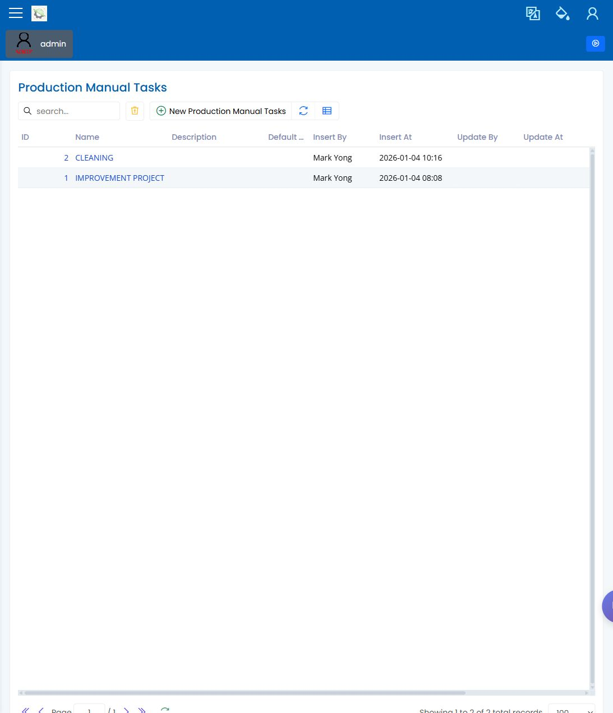

# Manual Tasks

> [English](manual-tasks.md) | [中文](../../zh-CN/10-production/manual-tasks.md)

Path: Master / Production / Worker / Manual Tasks  
URL: `<APP_BASE_URL>/Production/ProductionManualTasks`

## What This Page Is For

Use Manual Tasks to review worker task definitions that may appear during production execution. This page is a setup/reference screen for task definitions; it is not, by itself, proof that an operator has been assigned live manual work.

## What You See

- A grid of manual task records with names, status, and related production information.
- Search and filter controls for finding a task quickly.
- Add, edit, delete, export, refresh, and column controls when available to the signed-in user.
- Detail forms that show the selected task values.

## What You Do

1. Search for the task used in the workflow.
2. Open the row and confirm the displayed task name and status.
3. Check whether the task is active before expecting it in operator workflows.
4. Return to Queue System, Production Orders, or the assigned reporting screen to confirm whether the task appears as live work in the right context.

## What To Check

- The task label is clear enough for operators.
- The task is active and visible for the expected scenario.
- The task does not duplicate another visible choice.
- The owner has confirmed where assigned manual work is actually executed.

## Common Issues

| Issue | What it means |
|---|---|
| Task is missing | The filter may hide it, or the task may not be active. |
| Task name is unclear | Operators may need supervisor guidance before using it. |
| Task appears in the wrong workflow | Review the production setup before use. |
| Task exists here but not in live work | This page may only define the task; check Queue System or the assigned reporting screen. |

## Related Pages

- [Operator Manual](../03-by-role/operator.md)
- [Production Supervisor Manual](../03-by-role/production-supervisor.md)
- [Queue System](queue-system.md)

## Screenshot

