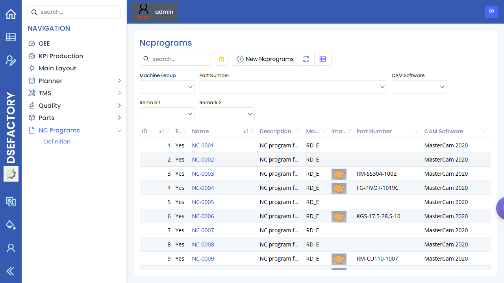

# NC Programs

> [English](nc-programs.md) | [中文](../../zh-CN/20-engineering/nc-programs.md)

Path: NC Programs / Definition  
URL: `<APP_BASE_URL>/Ncprograms/Ncprograms`

## What This Page Is For

Use NC Programs to review production program records before work reaches the floor. The page is mainly used by production engineering to confirm that the expected program is visible and ready.

## What You See

- A program list with identifying fields, names, status, and related production information.
- Search and filter controls for locating the program used by the site job.
- Toolbar actions for creating, editing, refreshing, exporting, and opening records when available.
- Detail forms for reviewing selected program information.

## What You Do

1. Search for the program linked to the selected part or operation.
2. Open the record and confirm the visible name, status, and context.
3. Compare the program with the recipe and machine setup before release.
4. Escalate missing or unclear program records to production engineering.

## What To Check

- The program record is visible for the expected part or process.
- The status supports production use.
- The selected machine or recipe context is consistent with the planned job.

## Common Issues

| Issue | What it means |
|---|---|
| Program is missing | The job may not be ready for execution. |
| Program name is unclear | Operators may need engineering confirmation before use. |
| Program does not match the machine | Engineering should review the setup before release. |

## Related Pages

- [Production Engineer Manual](../03-by-role/production-engineer.md)
- [Recipes](recipes.md)
- [Machines](machines.md)
- [Production Orders](../10-production/production-orders.md)

## Screenshot

