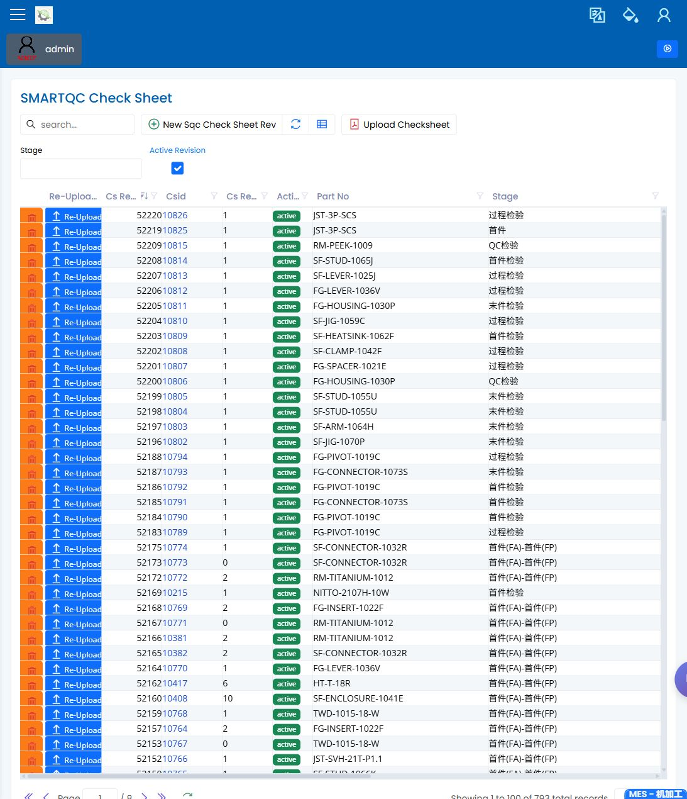

# SMARTQC Check Sheets

> [English](check-sheets.md) | [中文](../../zh-CN/35-smartqc/check-sheets.md)

Path: Quality / SMARTQC / Check Sheets  
URL: `needs-decision` (authenticated screenshot exists, but the exact deployed route was not recorded)

## What This Page Is For

Use SMARTQC Check Sheets to review the inspection template used by operators and quality engineers. A check sheet controls which characteristics are inspected, what limits or result choices are visible, and which version should be used for production review.

## What You See

- A check-sheet list with search, filters, and action buttons.
- Version information for the selected check sheet.
- A dialog that shows header details, CMM program information when present, method timing, and inspection items.
- Import or re-upload actions when a check sheet is maintained from an Excel file.

## What You Do

1. Search for the part, stage, or active version.
2. Open the version and review the header details.
3. Check that the inspection item list contains the expected characteristics and limits.
4. Confirm method timing and CMM program details where they are used.
5. Use upload or re-upload only when the reviewed file is the correct version.

## What To Check

- The active version is the one expected for the site job.
- The stage and part information match the inspection plan.
- Inspection items are visible and ordered clearly enough for review.
- Upload actions should not be used during workflow review unless the file has been approved.

## Common Issues

| Issue | What it means |
|---|---|
| Expected version is missing | Filters may hide inactive versions, or the version has not been uploaded. |
| Upload fails | Required header fields or the Excel file may be missing. |
| A method appears unexpectedly | The uploaded file may contain a method name that was not reviewed. |
| Inspection plan cannot use the sheet | The active version, part, or stage may not match the planned inspection. |

## Related Pages

- [SMARTQC Inspection Data Entry](inspection-data-entry.md)
- [SMARTQC Methods and Groups](methods-and-groups.md)
- [Inspection Planning](../30-quality/inspection-planning.md)
- [Quality Engineer Manual](../03-by-role/quality-engineer.md)

## Screenshot

