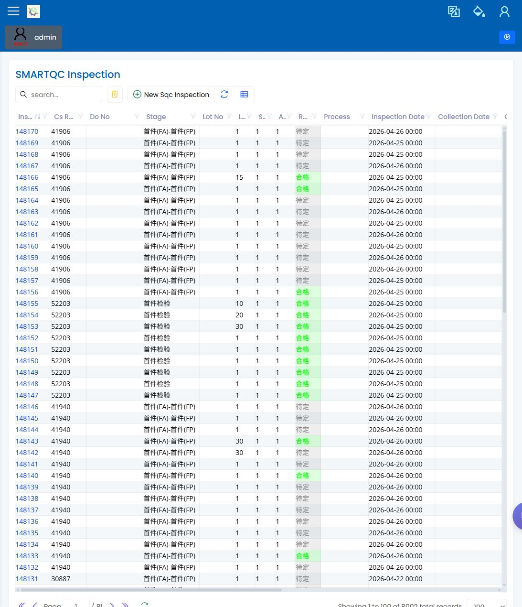

# SMARTQC Inspection Data Entry

> [English](inspection-data-entry.md) | [中文](../../zh-CN/35-smartqc/inspection-data-entry.md)

Path: Quality / SMARTQC / Inspection  
URL: `needs-decision` (authenticated screenshot exists, but the exact deployed route was not recorded)

## What This Page Is For

Use SMARTQC Inspection Data Entry to enter, review, and save inspection results. Operators use it when a job requires inspection, and quality engineers use it to review saved measurement evidence.

## What You See

- An inspection list with search and filters.
- A maximized inspection dialog when a row is opened.
- Header fields for the inspection context, lot, sample, result, and remarks.
- A result chart and an editable measurement grid.
- Save, undo, filter, and export actions where the role allows them.

## What You Do

1. Search for the inspection by job, stage, lot, or date.
2. Open the inspection and confirm the header details.
3. Enter or review measurement values in the grid.
4. Check the result chart and row results before saving.
5. Save changes, then confirm the visible update time or result status changed as expected.

## What To Check

- The inspection belongs to the correct job and stage.
- Required header fields are filled before save.
- Measurement rows show the expected characteristics and limits.
- Result colors and status labels are clear to the reviewer.

## Common Issues

| Issue | What it means |
|---|---|
| Save is disabled | Required visible fields may be empty, or the role may not allow edits. |
| A value cannot be typed | The row may be controlled by machine or CMM collection. |
| Result does not change | The value may be outside the expected format or needs manual result selection. |
| Wrong rows are visible | Clear the subgroup or grid filters. |

## Related Pages

- [SMARTQC Check Sheets](check-sheets.md)
- [SMARTQC Methods and Groups](methods-and-groups.md)
- [Inspection Planning](../30-quality/inspection-planning.md)
- [Quality Engineer Manual](../03-by-role/quality-engineer.md)

## Screenshot

