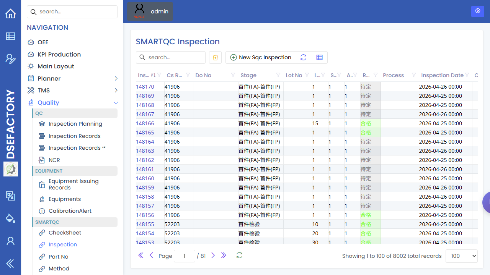

# 操作员手册

> [English](../../en/03-by-role/operator.md) | 中文

您是**车间操作员**。您的工作是执行已分派作业、上报现场情况、完成必要检查，并及时联系负责人处理阻塞。
根据现场部署，日常执行可能在专用终端/工位终端流程中完成；本 Web 手册记录对应的工单、队列、
手动任务与质量录入。

## 第一天检查清单

运行第一项分派作业前，先完成本清单。

1. **开始条件：** 您已登录，准备执行第一项分派作业。
   **打开屏幕：** [管理员设置清单](../01-workflows/admin-setup-checklist.md)。
   **步骤：** 确认登录用户、角色，以及如现场使用的作业人员身份。
   **预期结果：** 选择作业前，分派身份已经明确。
   **停止/联系条件：** 如果用户-作业人员关系为 `待确认`，请停止并联系主管或管理员。
2. **开始条件：** 身份已经明确。
   **打开屏幕：** [队列系统](../10-production/queue-system.md)。
   **步骤：** 只选择主管或现场流程指定的机台、产线、工作区域、日期或状态筛选。
   **预期结果：** 队列视图与分派给您的机台或工作区域一致。
   **停止/联系条件：** 如果队列筛选或工作区域不明确，请停止并联系主管。
3. **开始条件：** 指定队列视图已打开。
   **打开屏幕：** [操作员下一作业流程](../01-workflows/operator-run-next-job.md)。
   **步骤：** 把队列行与指定 WO/作业、零件、工序和可见状态匹配。
   **预期结果：** 不依赖行顺序，也能记录该行就是分派作业。
   **停止/联系条件：** 如果派工规则、优先级或行身份未确认，请停止并联系主管。
4. **开始条件：** 队列行已确认。
   **打开屏幕：** [队列系统](../10-production/queue-system.md)。
   **步骤：** 只有行打开/开始操作有标签或经主管确认时，才使用该操作。
   **预期结果：** 作业打开、开始，或出现负责人确认的状态变化。
   **停止/联系条件：** 如果操作无标签、被隐藏，或与现场流程不同，请停止并联系主管。
5. **开始条件：** 作业已开始或准备报工。
   **打开屏幕：** 指定生产报工页面。
   **步骤：** 只在指定报工路径记录产出、停机或问题说明。
   **预期结果：** 离开页面前，必填字段、保存操作和确认信号已明确。
   **停止/联系条件：** 如果报工路径、字段、保存操作或确认信号为 `待确认`，请停止并联系主管或计划员。
6. **开始条件：** 作业已完成到可交接，或班次需要停止。
   **打开屏幕：** [队列系统](../10-production/queue-system.md)、[工单](../10-production/production-orders.md)或指定报工页面。
   **步骤：** 刷新后核对同一 WO/作业，并记录未完成工作、已保存产出或主管确认。
   **预期结果：** 交接证据说明发生了什么变化，以及还有什么未完成。
   **停止/联系条件：** 如果队列行消失是唯一完成信号，请先联系主管确认，不要直接假设完成。

## 日常流程

```
开始班次
    |
    v
确认分派作业与机台
    |
    v
运行作业、上报产出、停机与问题
    |
    v
完成必要检验或 SMARTQC 录入
    |
    v
交接未完成工作
    |
    v
结束班次
```

## 最常用的屏幕

| 屏幕                                             | 您在这里做什么                              |
| ---------------------------------------------- | ------------------------------------ |
| [队列系统](../10-production/queue-system.md)       | 查看机台或产线等待执行的作业。                      |
| [工单](../10-production/production-orders.md)    | 查询工单状态、零件、数量、交期与相关工序明细。              |
| [手动任务](../10-production/manual-tasks.md)       | 复查可能出现在指定流程中的任务定义；实时工作仍以指定队列或报工页面为准。 |
| [检验录入](../35-smartqc/inspection-data-entry.md) | 在当前 SMARTQC 检验流程中录入测量值。              |
| [检验记录](../30-quality/inspection-records.md)    | 确认已完成检验是否保存、是否合格。                    |

## 开工前

1. 确认您使用的是正确的用户或作业人员身份。
2. 确认机台或产线与分派给您的工作一致。
3. 在[队列系统](../10-production/queue-system.md)查看下一项作业。
4. 如需零件、数量、交期、工序或产品族信息，打开[工单](../10-production/production-orders.md)。
5. 开工前确认是否有需要执行的检验指示。

## 作业中

| 事件 | 怎么做 |
|---|---|
| 机台开始加工 | 按部署的终端或现场流程确认开始。 |
| 产生数量 | 通过终端或授权的生产上报流程记录产出。 |
| 机台异常停机 | 上报停机，或通知生产主管。 |
| 需要检验 | 使用[检验录入](../35-smartqc/inspection-data-entry.md)或指定质量页面。 |
| 无法继续生产 | 通知生产主管，并准备好工单、机台、零件与原因。 |

## 您通常不做的

- 创建或修改零件、BOM、配方、机台或 NC 程序。这些由[生产工程师](production-engineer.md)、
  [计划员](planner.md)或管理员负责。
- 定义检验表。这由[质量工程师](quality-engineer.md)负责。
- 修改用户权限或主配置。这由管理员负责。

## 常见问题

| 问题 | 可能原因 | 下一步 |
|---|---|---|
| 看不到分派给我的工单 | 工单未释放、队列过滤不同、用户/机台分配错误 | 请[生产主管](production-supervisor.md)或计划员检查队列与工单状态 |
| 检验录入的保存按钮不可用 | 必填字段为空，或角色没有权限 | 先检查必填字段，再联系 QA 或管理员处理 |
| 工单明细看起来不对 | 配方、BOM、零件修订或 NC 程序可能错误 | 联系生产主管或生产工程师处理 |

## 截图

建议为本角色补充以下截图：

| 截图 | 建议页面 |
|---|---|
| 机台队列 | [队列系统](../10-production/queue-system.md) |
| 工单查询 | [工单](../10-production/production-orders.md) |
| 手动任务列表 | [手动任务](../10-production/manual-tasks.md) |
| 检验记录查询 | [检验记录](../30-quality/inspection-records.md) |
| SMARTQC 检验录入 | [检验录入](../35-smartqc/inspection-data-entry.md) |


队列截图展示已登录后的 [Queue System](../10-production/queue-system.md) 页面，用于查看各工位和工序等待执行的工作。



SMARTQC 截图展示已登录后的检验录入页面，操作员在需要测量或质量检验时使用该页面。


[手动任务](../10-production/manual-tasks.md)截图展示任务定义页面。已分派的手动工作仍需要在现场流程使用的队列或报工页面中确认。


[检验记录](../30-quality/inspection-records.md)截图展示生产或质量复查后查看已保存检验结果的位置。

## 接下来读

- [操作员下一作业流程](../01-workflows/operator-run-next-job.md)
- [生产主管手册](production-supervisor.md)
- [检验录入](../35-smartqc/inspection-data-entry.md)
- [检验记录](../30-quality/inspection-records.md)
- [操作词汇表](../00-glossary.md)
