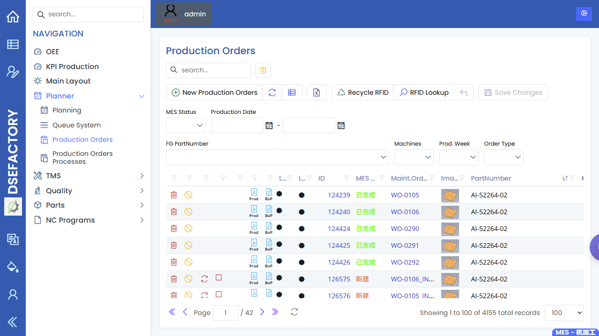
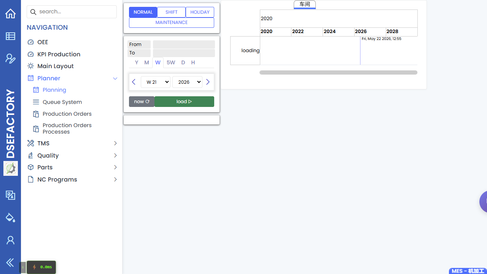

# 计划员手册

> [English](../../en/03-by-role/planner.md) | 中文

您是**生产计划员**。您把需求转成已排程、已释放、可跟踪的工单。您依赖生产工程提供有效配方与路线，
并依赖质量工程确认检验准备。

## 第一天检查清单

释放第一张样板 WO 或培训 WO 前，先完成本清单。

| 检查项 | 打开 | 安全结果 | 停止条件 |
|---|---|---|---|
| 访问权限 | [管理员设置清单](../01-workflows/admin-setup-checklist.md) | 计划员角色可打开工单、计划、队列系统和看板。 | 角色或权限标签仍是 `needs-decision`。 |
| 物料准备 | [零件](../20-engineering/parts.md)、[BOM](../20-engineering/bom.md) | 零件修订和 BOM 结构与培训 WO 一致。 | 零件或结构缺失。 |
| 路线准备 | [配方](../20-engineering/recipes.md)、[机台](../20-engineering/machines.md)、[NC 程序](../20-engineering/nc-programs.md) | 所选作业的配方、机台/工作区域和 NC 程序可见。 | 路线或机台能力不明确。 |
| 样板 WO | [计划员冷启动流程](../01-workflows/planner-cold-start.md) | 可以用已确认控制搜索或建立 WO。 | 释放、排程或状态操作没有标签。 |
| 队列确认 | [队列系统](../10-production/queue-system.md) | WO/作业出现在预期筛选下，并映射到已记录的队列状态。 | 派工或队列就绪标签不明确。 |

## 计划流程

```
需求到达
      |
      v
核对零件、BOM、配方、机台准备
      |
      v
新建或生成工单
      |
      v
在计划页面排程
      |
      v
释放到车间
      |
      v
监控队列、看板与异常
```

## 最常用的屏幕

| 屏幕                                                                    | 您在这里做什么                                                 |
| --------------------------------------------------------------------- | ------------------------------------------------------- |
| [零件](../20-engineering/parts.md) 与 [BOM 主档](../20-engineering/bom.md) | 确认拟计划的物料存在且结构正确。                                        |
| [配方](../20-engineering/recipes.md)                                    | 在生成工单前确认所选配方/路线有效。                                      |
| [工单](../10-production/production-orders.md)                           | 新建工单、检查生成的子单、设定数量与日期，并执行允许的状态操作。                        |
| [计划](../10-production/planning.md)                                    | 按日期、机台组与计划视图排程工单。                                       |
| [队列系统](../10-production/queue-system.md)                              | 确认已释放工单进入执行队列。                                          |
| [看板](../10-production/dashboards.md)                                  | 打开 OEE、KPI Production 和 Main Layout 入口；指标定义仍以业务负责人确认为准。 |
| [状态操作](../10-production/production-orders.md)                         | 只在图标有标签或负责人确认后，才解释可见状态/操作图标。                          |

## 新建工单前

1. 确认零件与修订正确。
2. 确认 BOM已准备好支持计划数量。
3. 确认计划路线有对应配方。
4. 确认所需机台组与班次可用。
5. 如果工作需要检验，确认 QA 准备情况。

## 每日计划例行事项

| 时间 | 操作 |
|---|---|
| 上班开始 | 查看未结需求、今日到期工单与被阻塞工单。 |
| 释放前 | 检查零件、BOM、配方、数量、交期与机台组。 |
| 班中 | 关注[队列系统](../10-production/queue-system.md)，响应生产主管升级。 |
| 变更后 | 重新检查[计划](../10-production/planning.md)，确保排程与现场一致。 |
| 下班前 | 查看[看板](../10-production/dashboards.md)，并复查需要重排、取消或强制结束的工单。 |

## 问题上报规则

- 配方、路线、机台能力、节拍或 NC 程序问题，联系[生产工程师](production-engineer.md)处理。
- 检验设置失败或缺失，联系[质量工程师](quality-engineer.md)处理。
- 用户访问或权限缺失，联系管理员处理。

## 常见问题

| 问题 | 可能原因 | 下一步 |
|---|---|---|
| 生成工单缺少预期子单 | 配方或工序定义不完整 | 请生产工程检查配方/工序设置 |
| 计划板为空 | 日期范围、机台组或计划页面过滤排除了工单 | 放宽过滤并检查工单状态 |
| 工单在计划中但不在队列中 | 工单可能未发布，或队列页面过滤不同 | 检查状态与队列过滤 |
| 工单卡在生产中 | 子作业可能未关闭，或数量未完成 | 先检查可见状态；在使用不明确的操作图标前联系主管处理 |

## 截图

建议为本角色补充以下截图：

| 截图 | 建议页面 |
|---|---|
| 工单列表与操作工具栏 | [工单](../10-production/production-orders.md) |
| 计划板 | [计划](../10-production/planning.md) |
| 机台队列 | [队列系统](../10-production/queue-system.md) |
| OEE/KPI 复盘 | [看板](../10-production/dashboards.md)截图请求 |
| 零件准备状态 | [零件](../20-engineering/parts.md) |
| BOM 结构 | [BOM](../20-engineering/bom.md) |



工单截图展示已登录后的工单列表、筛选条件、操作工具栏与状态栏位。



计划截图展示已登录后的计划工作区，用于查看排程负荷和计划视图。


零件截图展示已登录后的零件列表，用于确认计划对象已经建立并可用于生产复查。


BOM 截图展示已登录后的结构页面，用于确认父件与子件关系。

[看板](../10-production/dashboards.md)页面仍需要单独的 OEE、KPI Production 和 Main Layout 截图，然后本角色页才能详细说明这些指标。

## 接下来读

- [生产工程师手册](production-engineer.md)
- [生产主管手册](production-supervisor.md)
- [计划员冷启动流程](../01-workflows/planner-cold-start.md)
- [工单](../10-production/production-orders.md)
- [操作词汇表](../00-glossary.md)
