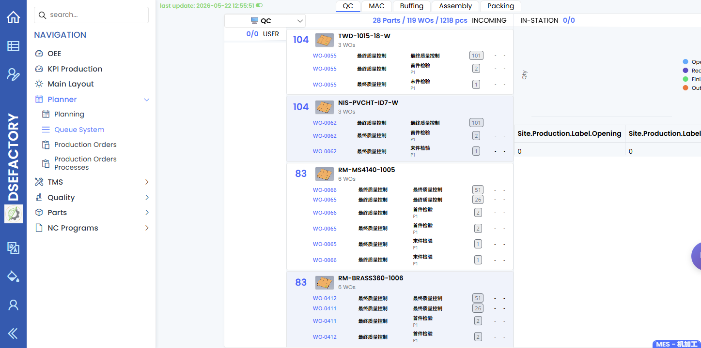

# 生产主管手册

> [English](../../en/03-by-role/production-supervisor.md) | 中文

您是**生产主管或线长**。您负责盯住当前班次，让已释放工单持续推进，协调操作员，
并判断工单问题应升级给计划、工程、质量还是系统管理。

## 班次流程

```
班前
    |
    v
查看已释放工单 + 机台队列
    |
    v
安排关注点：人员、机台、材料、质量
    |
    v
监控队列、看板、产出、停机、质量保留
    |
    v
处理阻塞或升级
    |
    v
班末交接
```

## 最常用的屏幕

| 屏幕 | 您在这里做什么 |
|---|---|
| [队列系统](../10-production/queue-system.md) | 查看每台机台或产线下一步应运行什么。 |
| [计划](../10-production/planning.md) | 检查排程负载，并确认临时变更是否已反映。 |
| [工单](../10-production/production-orders.md) | 检查工单状态、数量、嵌套工单与可用状态动作。 |
| [看板](../10-production/dashboards.md) | 打开 OEE、KPI Production 和 Main Layout 查看高层级信号；指标定义仍以业务负责人确认为准。 |
| [手动任务](../10-production/manual-tasks.md) | 确认任务定义，并确认现场流程中已分派手动工作在哪里跟踪。 |
| [检验记录](../30-quality/inspection-records.md) | 检查是否有质量失败或待检阻塞生产。 |

## 班前检查清单

1. 打开[队列系统](../10-production/queue-system.md)，确认每台机台或产线的首批作业。
2. 打开[计划](../10-production/planning.md)，比较排程与队列是否一致。
3. 在[工单](../10-production/production-orders.md)检查已释放工单是否缺数量、交期、配方或机台分配。
4. 在[检验记录](../30-quality/inspection-records.md)或 [NCR](../30-quality/ncr-non-conformance.md)
   检查质量保留。

## 生产被阻塞时

| 阻塞 | 先看页面 | 升级给 |
|---|---|---|
| 工单未释放或未排程 | [工单](../10-production/production-orders.md)、[计划](../10-production/planning.md) | 计划员 |
| 机台能力或 NC 程序错误 | [机台](../20-engineering/machines.md)、[NC 程序](../20-engineering/nc-programs.md) | 生产工程师 |
| 检验失败或 NCR 未关闭 | [检验记录](../30-quality/inspection-records.md)、[NCR](../30-quality/ncr-non-conformance.md) | 质量工程师 |
| 用户无法访问页面 | [用户和角色](../40-administration/users-and-roles.md) | 管理员 |

## 班末交接

记录或交代：

- 已完成、仍在运行、或被阻塞的工单。
- 机台停机与未解决的机台问题。
- 质量失败、NCR 编号，以及需要跟进的检验记录。
- 仍未关闭的手动任务。
- 对工单执行过的状态动作，尤其是取消、重置、强制结束。

## 截图

建议为本角色补充以下截图：

| 截图 | 建议页面 |
|---|---|
| 班次队列 | [队列系统](../10-production/queue-system.md) |
| 计划板 | [计划](../10-production/planning.md) |
| 工单状态/动作区域 | [工单](../10-production/production-orders.md) |
| 生产主看板 | [看板](../10-production/dashboards.md)截图请求 |
| 手动任务列表 | [手动任务](../10-production/manual-tasks.md) |
| 检验记录查询 | [检验记录](../30-quality/inspection-records.md) |



队列截图展示已登录后的班次视图，用于确认各工位等待执行的工作和阻塞位置。


工单截图展示主管处理或升级工单阻塞时查看的状态和动作区域。

[看板](../10-production/dashboards.md)页面仍需要单独的 OEE、KPI Production 和 Main Layout 截图，然后本角色页才能详细说明这些信号。


[手动任务](../10-production/manual-tasks.md)截图展示任务定义页面。请使用现场流程指定的队列或报工页面确认已分派手动工作。


检验记录截图展示当质量状态阻塞生产时，主管查看已保存检验结果的位置。

## 接下来读

- [操作员手册](operator.md)
- [计划员手册](planner.md)
- [主管排查流程](../01-workflows/supervisor-triage.md)
- [工单](../10-production/production-orders.md)
- [检验记录](../30-quality/inspection-records.md)
