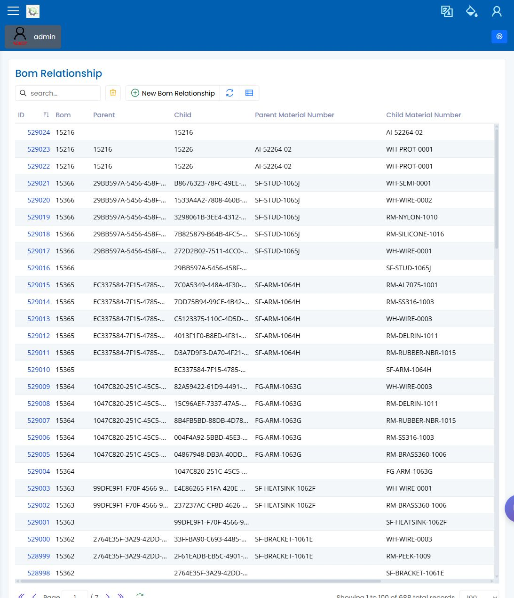

# BOM

> [English](../../en/20-engineering/bom.md) | 中文

Path: Parts / BOM Master and BOM Structure  
URL: `<APP_BASE_URL>/BOM/BomMaster`, `<APP_BASE_URL>/BOM/BOMStructure/BOMStructureDiagram`

## 页面用途

BOM 页面用于在作业计划前复查父件和子件的物料关系。复查人员应能确认计划物料是否具有预期结构。

## 页面显示内容

- 父件的 BOM 主记录。
- 显示子件和数量的结构或图形视图。
- 用于查找父件的搜索和筛选控制。
- 在可用时打开、刷新、导出和复查记录的工具栏操作。

## 常用操作

1. 搜索现场流程使用的父件。
2. 打开 BOM 或结构视图。
3. 确认可见子件和数量符合预期生产。
4. 如果结构缺失或异常，释放生产作业前先联系负责人处理。

## 要检查什么

- 父件是预期零件。
- 子件和数量清楚可见且合理。
- 显示结构与计划生产路线一致。
- 结构未理解清楚前，不继续进行计划。

## 常见问题

| 问题 | 含义 |
|---|---|
| 父件没有结构 | 该 BOM 可能尚未为现场场景准备好。 |
| 子件数量看起来错误 | 释放前请工程或计划复查。 |
| 结构与配方预期不一致 | 确认现场流程应以哪个设置为准。 |

## 相关页面

- [零件](parts.md)
- [配方](recipes.md)
- [计划员手册](../03-by-role/planner.md)
- [生产工程师手册](../03-by-role/production-engineer.md)

## 截图

