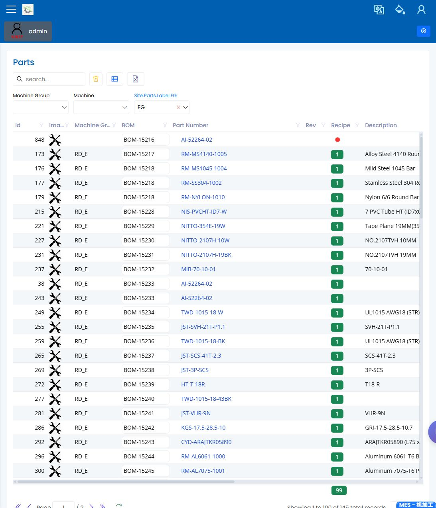

# 零件

> [English](../../en/20-engineering/parts.md) | 中文

Path: Parts / Parts  
URL: `<APP_BASE_URL>/Parts/Parts`

## 页面用途

Parts 用于在计划、工程或质量复查继续前确认物料存在。它是演示中确认物料身份的共同参考页面。

## 你会看到什么

- 可搜索的零件列表，包含识别字段和状态信息。
- 在账号允许时显示的新建、编辑、导出、刷新和列设置控制。
- 按零件、描述、类型或状态缩小范围的筛选条件。
- 用于复查所选零件的详细表单。

## 你会做什么

1. 搜索演示场景中使用的零件。
2. 在检查 BOM 或配方前确认屏幕上的物料身份。
3. 打开行并复查会影响计划或工程检查的可见字段。
4. 使用相关页面确认 BOM、配方、机台或质量准备情况。

## 要检查什么

- 正确零件出现在列表中。
- 零件名称、编号和状态与演示场景一致。
- 计划员建立或释放作业前，零件已经准备好。

## 常见问题

| 问题 | 含义 |
|---|---|
| 找不到零件 | 搜索条件可能太窄，或该物料尚未为演示准备好。 |
| 出现相似零件 | 计划或质量复查前先确认准确物料。 |
| 零件存在但作业无法继续 | BOM、配方、机台或检验设置可能仍需复查。 |

## 相关页面

- [BOM](bom.md)
- [配方](recipes.md)
- [计划员手册](../03-by-role/planner.md)
- [生产工程师手册](../03-by-role/production-engineer.md)

## 截图

