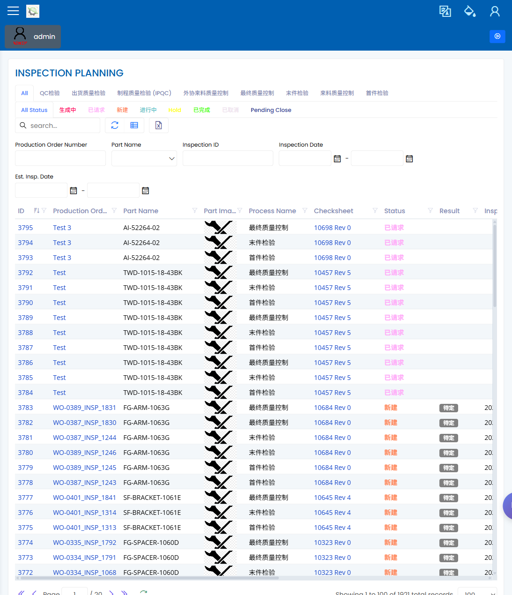

# 检验计划

> [English](../../en/30-quality/inspection-planning.md) | 中文

Path: Quality / Inspection Planning  
URL: `needs-decision`（已有登录截图，但未记录准确部署路由）

## 页面用途

Inspection Planning 用于确认生产的哪些阶段需要在生产前、生产中或生产后检验。该区域仍待负责人确认是否纳入使用范围，因此本手册保留页面，并把不一致项列为待决事项，而不是删除内容。

## 页面显示内容

- 与生产作业相关的计划检验列表。
- 可按工单、工序、阶段、结果或日期缩小范围的筛选条件。
- 打开所选检验计划的表单或对话框。
- 显示检验是否待处理、接受、拒收或需要跟进的结果和状态字段。

## 常用操作

1. 从 Quality 区域打开页面。
2. 按正在复查的工单、工序或检验阶段筛选。
3. 打开行并确认零件、工序阶段、抽样信息和预期检验路线。
4. 确认继续生产前是否需要 SMARTQC 检验表或检验录入。
5. 如发现不一致，在放行前升级给计划员、生产工程师或质量工程师。

## 要检查什么

- 行记录属于正确的作业和工序阶段。
- 检验阶段名称与操作员预期看到的一致。
- 屏幕上的状态或结果能支持生产决定。
- 作业放行前可以看到所需检验设置。

## 常见问题

| 问题 | 含义 |
|---|---|
| 筛选后没有行 | 作业可能没有检验计划，或筛选条件太窄。 |
| 阶段与操作不一致 | 检验可能关联到了错误的工序步骤。 |
| 操作员找不到检验 | 作业可能尚未释放到预期阶段，或检验表尚未准备好。 |
| 结果不明确 | 请质量人员确认检验记录，再决定是否放行下一步。 |

## 相关页面

- [质量工程师手册](../03-by-role/quality-engineer.md)
- [SMARTQC 检验表](../35-smartqc/check-sheets.md)
- [SMARTQC 检验录入](../35-smartqc/inspection-data-entry.md)
- [NCR 不合格](ncr-non-conformance.md)

## 截图

