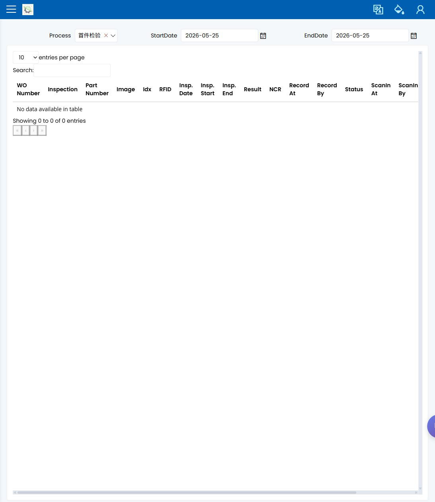

# 检验记录

> [English](../../en/30-quality/inspection-records.md) | 中文

Path: Quality / QC / Inspection Records  
URL: `<APP_BASE_URL>/Production/InspectionRecord`

## 页面用途

Inspection Records 用于确认检验作业是否已经保存，以及结果是否支持下一步生产决定。操作员和主管用它做确认，质量工程师用它复查和跟进。

## 你会看到什么

- 已保存检验记录列表。
- 可按作业、零件、阶段、结果、日期或相关生产信息缩小范围的筛选条件。
- 显示检验通过、失败或仍需跟进的结果和状态字段。
- 用于复查所选检验记录的行详情。

## 你会做什么

1. 使用生产流程中的 WO、作业、零件、阶段、批次或日期搜索。
2. 打开匹配记录。
3. 确认记录属于正在复查的同一作业或工序。
4. 在释放、继续或交接前检查可见结果。
5. 如果结果不清楚或失败，升级给质量工程师。

## 要检查什么

- 记录与 WO/作业和检验阶段匹配。
- 已保存结果可见。
- 结果支持下一步生产决定。
- 失败或不清楚的结果未在质量复查前被当作可生产状态。

## 常见问题

| 问题 | 含义 |
|---|---|
| 找不到记录 | 检验可能尚未保存，或筛选条件太窄。 |
| 记录与作业不匹配 | 可能选错了 WO、零件、阶段或日期。 |
| 结果失败或不清楚 | 生产继续前必须由质量确认下一步。 |

## 相关页面

- [操作员流程](../01-workflows/operator-run-next-job.md)
- [主管排查](../01-workflows/supervisor-triage.md)
- [SMARTQC 检验](../35-smartqc/inspection-data-entry.md)
- [NCR](ncr-non-conformance.md)

## 截图

