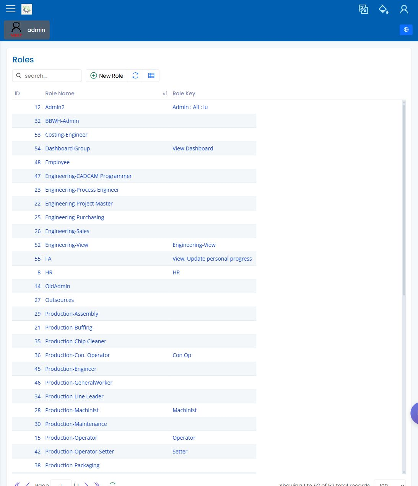

# 用户和角色

> [English](../../en/40-administration/users-and-roles.md) | 中文

Path: Administration / User Management and Administration / Roles  
URL: `<APP_BASE_URL>/Administration/User`, `<APP_BASE_URL>/Administration/Role`

## 页面用途

Users and Roles 用于复查谁可以登录，以及某个角色可以使用哪些可见菜单和操作。本章只说明屏幕上可见的管理流程。

用户-工人关系、权限标签含义和语言设置在管理员或实施负责人确认前，仍记录在[证据与待决事项登记](../00-open-decisions.md)中。

> **Needs decision:** 本页只确认可见访问。用户-工人关系、权限标签、角色名称和语言设置必须由管理员或实施负责人确认后，才能视为最终设置。

## 第一天访问检查清单

在计划员、操作员、主管或质量用户开始流程前，先完成本清单。

| 检查项 | 安全结果 | 停止条件 |
|---|---|---|
| 登录账号 | 用户存在、启用，并能登录。 | 用户缺失、停用或登录身份不明确。 |
| 角色分配 | 分配角色与培训场景一致。 | 角色名称或权限标签仍是 `needs-decision`。 |
| 侧边栏可见性 | 该角色必需页面在登录后可见。 | 生产、质量、SMARTQC 或管理页面异常隐藏。 |
| 操作可见性 | 所需按钮、图标、行操作和保存控制在对应页面可见。 | 操作缺失或没有标签。 |
| 工人身份 | 操作员身份、如现场使用的工人记录、机台/工作区域和角色已记录。 | 用户-工人关系尚未确认。 |
| 证据 | 已保留用户/角色截图和受影响页面截图。 | 无法用可见标签复现问题。 |

## 页面显示内容

- 用户管理列表，用于复查账号、姓名、状态和相关登录信息。
- 角色页面，用于复查角色名称和可见权限标签。
- 在可用时显示的搜索、刷新、导出和列设置控制。
- 复查所选用户或角色的详细表单或对话框。

## 常用操作

1. 打开 User Management，确认预期用户存在且处于可用状态。
2. 打开 Roles，确认现场流程使用的角色名称。
3. 只有在解释为什么菜单项或操作出现时，才复查屏幕上可见的权限标签。
4. 除非管理员明确批准，否则不要在流程执行期间更改访问设置。

## 要检查什么

- 用户处于可用状态。
- 分配的角色符合预期复查场景。
- 可见侧边栏和按钮与该角色一致。
- 缺失页面先作为访问或范围问题处理，再考虑修改数据。

## 常见问题

| 问题 | 含义 |
|---|---|
| 用户看不到某个菜单项 | 分配角色可能不包含该可见页面或操作。 |
| 用户不可用 | 账号可能需要管理员复查。 |
| 权限标签不明确 | 更改角色设置前先与管理员确认。 |

## 相关页面

- [管理员设置清单](../01-workflows/admin-setup-checklist.md)
- [按角色阅读的用户手册](../03-by-role/README.md)
- [计划员手册](../03-by-role/planner.md)
- [操作员手册](../03-by-role/operator.md)
- [质量工程师手册](../03-by-role/quality-engineer.md)

## 截图

